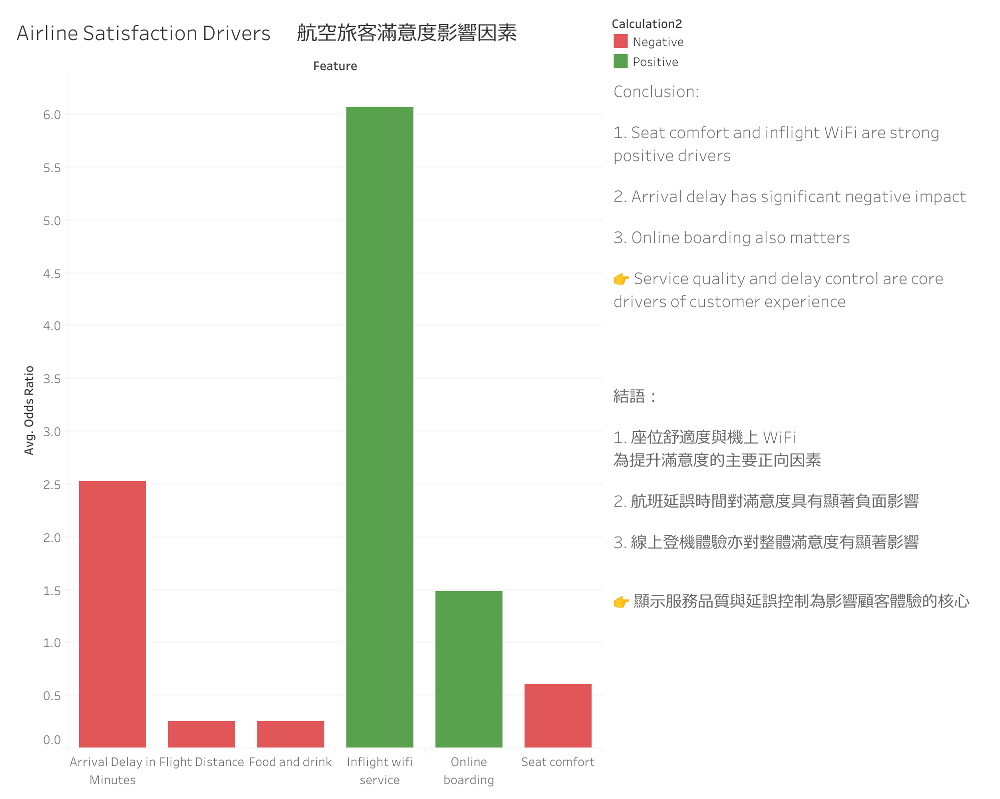

# Airline Passenger Satisfaction Analysis

## Project Overview
**How do flight delays impact passenger satisfaction, and which factors should airlines prioritize for improvement?**  
<small>This project analyzes the effects of flight delays, cabin class, and customer loyalty on passenger satisfaction, and provides actionable business insights.</small>

---

## Key Findings
- **Passenger satisfaction drops significantly when delays exceed 15 minutes**, especially in Economy class  
- **Business class passengers are less sensitive to delays**, suggesting premium service buffers dissatisfaction  
- **Loyal customers maintain higher satisfaction even during delays**, helping reduce churn  

---

## Business Recommendations
Based on impact analysis:

- **Prioritize delay reduction (highest impact)**  
→ Keep average delays under 15 minutes to prevent sharp satisfaction decline  

- **Introduce compensation strategies for Economy class (high ROI)**  
→ Dissatisfaction often comes from poor communication and lack of compensation; meal vouchers or mileage credits can improve satisfaction  

- **Strengthen loyalty programs (long-term strategy)**  
→ Increase tolerance toward negative experiences and reduce customer churn  

---

## Data Visualization

---

## Model Analysis (Logistic Regression)
To quantify the impact of different factors on satisfaction, a **Logistic Regression model** was built:

- **Target variable:** satisfied vs dissatisfied  
- **Features:**
  - Arrival delay time  
  - Cabin class  
  - Customer type (loyal vs non-loyal)  

### Model Insights
- **Delay time** is the strongest negative predictor  
- **Business class and loyal customers** show positive coefficients  
- Model results align with exploratory analysis, increasing confidence in findings  

---

## Interactive Dashboards

👉 [View Tableau Dashboard](https://public.tableau.com/views/AirlinePassengerSatisfactionAnalysis_17768549589120/Dashboard1?:language=en-US&:sid=&:redirect=auth&:display_count=n&:origin=viz_share_link)

👉 [View Drivers Analysis Dashboard](https://public.tableau.com/views/AirlineSatisfactionDrivers/Dashboard1?:language=en-US&:sid=&:redirect=auth&:display_count=n&:origin=viz_share_lin)

<small>👉 中文版本請見 <航空旅客滿意度分析> (https://github.com/hlr95035339/Airline-Passenger-Satisfaction-Analysis_CN.git)</small>

---

## Data Source
- Kaggle Airline Passenger Satisfaction Dataset (`test.csv`)

**Key variables:**
- Satisfaction  
- Cabin Class (Economy, Economy Plus, Business)  
- Customer Type (Loyal vs Non-loyal)  
- Arrival Delay in Minutes  

---

## Methodology
- Data cleaning and exploratory analysis using Python (Pandas)  
- Analyzed relationship between delay time and satisfaction  
- Built a **Logistic Regression model** for prediction  
- Developed interactive dashboards using Tableau  

---

## Project Value
This project demonstrates an end-to-end analytics workflow, helping businesses:
- Identify key drivers of customer satisfaction  
- Prioritize operational improvements  
- Optimize service quality while managing costs  

---

## Skills Demonstrated
- Python (Data Cleaning & EDA)  
- Tableau (Dashboard Design & Data Storytelling)  
- Logistic Regression (Predictive Modeling)  
- Business Analysis & Insight Generation  
