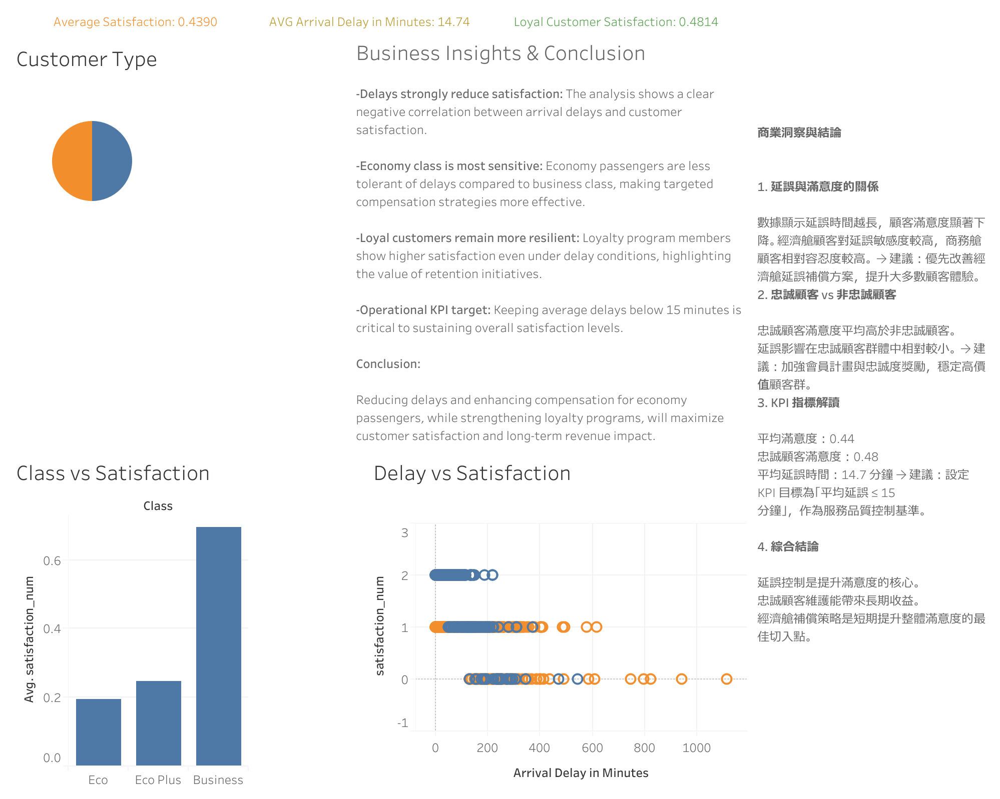

# Airline Passenger Satisfaction Analysis

## Overview
This project analyzes airline passenger satisfaction using the Kaggle dataset **test.csv**.  
The analysis focuses on how **arrival delays**, **cabin class**, and **customer loyalty** affect overall satisfaction.  
Python scripts (`script.py`) were used for data processing and visualization, and Tableau dashboards were created for interactive exploration.

---

## Data
- **Source**: Kaggle Airline Passenger Satisfaction dataset (`test.csv`)  
- **Key Variables**:  
  - Satisfaction score  
  - Cabin class (Economy, Economy Plus, Business)  
  - Customer type (Loyal vs Non-loyal)  
  - Arrival delay in minutes  

---

## Methods
- **Python Analysis** (`script.py`):  
  - Data cleaning and transformation with Pandas  
  - Statistical analysis (correlation, group comparisons)  
  - Exporting results for visualization  

- **Visualization**:  
  - Tableau dashboards (KPI cards, bar charts, scatter plots, pie charts)  
  - Static screenshot (`Dashboard.png`) for quick viewing  
  - Interactive version on Tableau Public  

---

## Visualizations

👉 [View Interactive Dashboard on Tableau Public](https://public.tableau.com/views/AirlinePassengerSatisfactionAnalysis_17768549589120/Dashboard1?:language=en-US&:sid=&:redirect=auth&:display_count=n&:origin=viz_share_link)
👉 中文版本請見 [航空旅客滿意度分析]

---

## Business Insights
- **Delays strongly reduce satisfaction**, especially in economy class.  
- **Business class passengers** show higher tolerance to delays.  
- **Loyal customers remain more resilient**, highlighting the importance of retention programs.  
- **Operational KPI target**: Keep average delays below 15 minutes to sustain satisfaction.  

---

## Conclusion
Reducing delays and enhancing compensation for economy passengers, while strengthening loyalty programs, will maximize customer satisfaction and long-term revenue impact.

---

## Skills Demonstrated
- Python data analysis (`script.py`)  
- Tableau dashboard design and KPI storytelling  
- Business insight generation from Kaggle dataset  
